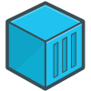

<div align="center">

<br>
<br>
<h1>Medhead ERS - Complet Application</h1>
</div>

<br>

Ce dépot contient les différents fichiers permettant de lancer facilement la totalité de l'application MedheadERS : 
 
 - L'application web (SPA Vue.Js)
 - Le serveur de web socket (WSS)
 - Les microservices backend (Java / Spring)
 - Le service redis
 - Le logiciel Traefik et sa configuration

## Requirement

L'application nécessite seulement à la machine hôte d'être en mesure de démarrer des conteneurs à l'aide de docker compose.

À noter, par défaut, les ports suivants vont être utilisés : 
- `8080` - Traefik dashboard (peut être modifié ou désactivé)
- `80` - Port utilisé par Traefik pour le mappage des requêtes HTTP
- `3500` - Port utilisé par Traefik pour le mappage des requêtes WS
- `3000` - Port par défaut pour accéder à la Web App

## How To 

Le lancement est extrêmement simple : 
 - Copier le fichier `.env.example`, le renommer en `.env` et personnaliser son contenu (voir doc fourni avec)
 - Copier le fichier `docker-compose.yml` au même endroit et lancer la commande :
   
 ```shell
   docker compose up -d
   ```

